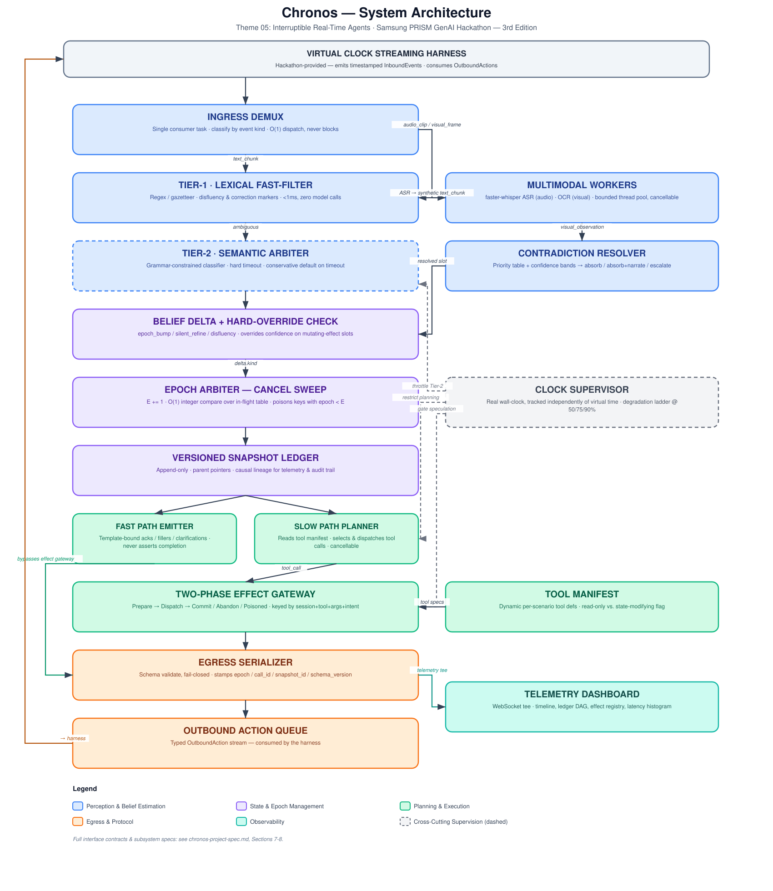

# Chronos

### Interruptible Real-Time Agent — Project Specification & Build Reference

**Samsung PRISM GenAI Hackathon — 3rd Edition (2026–27) · Theme 05: Interruptible Real-Time Agents**

**Document status:** FINALIZED — this is the authoritative reference for implementation.
**Last updated:** 19 September 2026

---

## 0. How to Use This Document

This document is the single source of truth for what Chronos is and how it is built. If code and this document ever disagree, this document wins — revise it here first, then change the code.

It is written for two audiences at once: **you**, and **any AI coding assistant** (Claude Code or similar) working on this repo. If you hand this file to a coding assistant, point it at:

- **Section 7** (Interface Contracts) before it writes any schema or message type
- **Section 5–6** (Architecture & Data Flow) before it touches any subsystem
- **Section 4** (Non-Negotiable Invariants) before it touches cancellation, effect dispatch, or the belief estimator — these are safety-critical and must never be "simplified" without updating this doc first

Reading order for a first pass: 1 → 2 → 3 → 5 → 4 → 7 → 8 → 9 → 14.

---

## 1. Problem Statement (Official — Theme 05)

> Standard AI assistants operate in half-duplex mode (listen, think, speak), failing in full-duplex conversations where users interrupt, re-plan, or correct themselves mid-sentence.

This is a **concurrency and state-consistency problem**, not a conversational-quality problem. Perception, reasoning, tool execution, and speech must run concurrently on a unified timeline. The mandated architecture is a dual-process model:

- **Fast Path** — responsive within a few hundred milliseconds (acknowledgment, clarification, progress narration)
- **Slow Path** — asynchronous tool execution, multimodal processing, complex reasoning
- **Coordination Layer** — non-blocking execution, call cancellation, state-snapshot updates, and **idempotency for state-modifying actions**

**Key use cases named in the brief:**

| Use case | What it demands |
|---|---|
| In-Car & Hands-Free | Drop stale route calculations when destination updates mid-execution |
| Customer Support Bots | Adjust booking parameters mid-flow without double-booking |
| Field & Consumer Troubleshooting | Ground device queries in camera frames and manuals |
| Accessibility | Resolve speech hesitations and conversational self-repairs |

**Interface contract (mandated, not optional):** participants implement an agent communicating over **two asynchronous queues** — a timestamped inbound event queue and an outbound action queue. Inputs include transcribed text chunks (with end-of-turn markers), raw audio (`.wav`), video frames (`.png`), interruption signals, async tool results, and per-scenario tool manifests. Outputs include spoken fillers, non-blocking tool calls (with explicit `call_id`), cancellations, clarification requests, and final responses carrying structured **State Snapshots** (intent + slot values).

**Six core technical objectives (from the brief):**
1. Floor Management — meaningful responses quickly, no false completion claims, no excessive fillers
2. Interruption Recovery — cancel superseded in-flight calls within a few-ms grace period, update snapshots, replan cleanly
3. Session Slot Tracking — session-scoped slot state, localized corrections
4. Schema-Driven Tools — parse read-only vs. state-modifying tool defs from manifests; strictly avoid duplicate state-changing calls
5. Multimodal Grounding — process audio/frames behind conversational acknowledgments; clarify ambiguous perception
6. Protocol Compliance — well-formed JSON payloads, valid snapshots and identifiers

---

## 2. Evaluation Criteria

Two distinct scoring frameworks apply, and Chronos is designed against **both**.

### 2.1 General Hackathon Rubric (Build & Submit stage)

| Category | Weight |
|---|---|
| Working prototype & functionality | 30% |
| Technical depth & feasibility | 25% |
| Innovation & originality | 20% |
| Relevance to theme | 15% |
| Presentation & documentation | 10% |

Top 15 teams (by 9 Oct) present live to a Samsung R&D jury on 15 Oct. The jury asks: does the prototype actually work, is the approach sound, would a real user want it, can it become a Worklet.

### 2.2 Theme 05 Automated Scoring Framework (trace-log based)

Every scenario is scored 0–100 **strictly from trace logs** against a deterministic virtual-clock harness — not from a live/subjective demo impression.

| Category | Weight | Criterion |
|---|---|---|
| Task Completion | 40% | Correct tool execution, valid argument extraction, state snapshot accuracy, grounded final response |
| Interruption Recovery | 35% | Prompt cancellation of invalidated calls, absence of stale re-runs, updated state snapshots |
| Response Latency | 15% | Time to first substantive spoken action following input or interruption |
| Safety & Protocol | 10% | Zero duplicate state-changing calls, structured schema adherence, valid state payloads |

A **quality multiplier (0.80×–1.20×)** applies on top, scoring transcript naturalness, truthfulness, and relevance. **Hidden-set multimodal scenarios carry a 1.5× multiplier** — audio/visual correctness is disproportionately rewarded, which is why the multimodal pipeline (Section 8.3) is a must-have, not a stretch goal.

**Test composition:** Public suite = 9 scenarios (50% text / 30% audio / 20% visual), covering interruptions, chained calls, retries, clarifications, unseen tools. Hidden set = ~60 scenarios at the same modality mix, testing edge cases and **adversarial timing**. The evaluation kit is released only after registration closes.

### 2.3 Hard Execution Constraints

- **Runtime:** Python 3.10–3.12
- **120-second wall-clock cap** per scenario
- **300-second setup/warm-up hook** — separate budget, for model/weight loading only
- **Session-scoped memory only** — no cross-session caching or profiling
- **Explicitly out of scope:** wake-word detection, voice synthesis tuning, UI design polish — do not spend build time here

---

## 3. Executive Summary — The Chronos Solution

**Chronos** is a virtual-clock-native agent kernel built around one primitive — a **monotonically increasing epoch counter** — that turns "was this work superseded?" from a judgment call into an O(1) integer comparison. Every artifact in the system (a tool call, a snapshot, an utterance) is stamped with the epoch that produced it; anything stamped with a stale epoch is refused, not reasoned about.

Five mechanisms carry the theme's scoring weight:

1. **Epoch Arbiter + Cancel Sweep** — deterministic, model-free cancellation decision (Interruption Recovery, 35%)
2. **Two-Phase Effect Gateway with poisonable idempotency keys** — makes duplicate state-changing calls structurally impossible, not just unlikely (Safety & Protocol, 10%; also the specific double-booking failure mode named in the brief)
3. **Versioned Snapshot Ledger** — plain append-only data structure with parent pointers; gives O(1) localized slot correction and a free audit trail (Task Completion, 40%)
4. **Two-Tier Belief Estimator** (lexical fast-filter → grammar-constrained semantic arbiter, with a hard deterministic override for safety-critical corrections) — classifies incoming events without letting a model sit on the critical cancellation path
5. **Dual-Clock Supervisor** — tracks real wall-clock time independently of virtual time, with a 50/75/90% degradation ladder that guarantees the system always "lands the plane" inside the 120s cap

The design was deliberately revised (see Section 5.4) from an earlier, more research-flavored draft (continuous Bayesian confidence fusion, an abstract CoW lattice) into the table-driven, deterministic mechanisms described here — every decision point in the system should be explainable as a lookup table or an integer comparison, not a formula, so it can be built, tested, and defended under adversarial Q&A within the sprint window.

---

## 4. Non-Negotiable Invariants

These are safety-critical and must hold under every test, including ones we haven't thought of. Any code change that would violate one of these needs a design review against this document first, not a quiet fix.

1. **No COMMIT executes if `registry[key].epoch != current_epoch` at commit time.** This is the entire double-booking defense — checked at prepare, at post-dispatch-return, and again defensively by the poisoning write happening synchronously inside the cancel sweep.
2. **Cancellation is decided by integer comparison only — never by a model call.** This is what makes the "few-ms grace period" achievable at all.
3. **The Fast Path is structurally incapable of asserting task completion.** Enforced at the type level (`ProvisionalUtterance` vs. `CommittedUtterance`), not by convention.
4. **All model/encoder loads happen only inside the 300s warm-up hook.** A cold load triggered inside the 120s live window is a bug to be caught in testing, never a runtime fallback.
5. **A slot correction touching a slot that backs an in-flight mutating effect always triggers an epoch bump**, regardless of what the belief classifier's confidence says. This deterministic override exists precisely so correctness does not depend on classifier accuracy.
6. **A `CancelledError` handler always re-raises after poisoning.** Swallowing it corrupts `TaskGroup` semantics and produces nondeterministic behavior under replay.
7. **Argument canonicalization is mandatory before hashing into an idempotency key.** Key-ordering artifacts (`{"pax":2,"city":"BLR"}` vs. `{"city":"BLR","pax":2}`) must never produce two different keys for the same logical call.

---

## 5. System Architecture

### 5.1 Architecture Diagram



### 5.2 Topology Narrative

Follow the diagram top to bottom:

1. The **harness** (provided by the hackathon kit) emits timestamped `InboundEvent`s and consumes `OutboundAction`s — Chronos never touches its internals.
2. The **Ingress Demux** is the single consumer of the inbound queue. It never awaits anything — it classifies by event `kind` and dispatches in O(1).
3. Text goes to the **Tier-1 Lexical Fast-Filter**; audio/visual events go to the **Multimodal Workers** (ASR / OCR, off the event loop via a bounded thread pool). ASR output re-enters the pipeline as a synthetic text chunk, so belief logic is written once, not once per modality.
4. If Tier-1 is ambiguous, the event escalates to the **Tier-2 Semantic Arbiter** (grammar-constrained, hard-timeout, conservative-on-timeout). Visual observations go instead to the **Contradiction Resolver**, which reconciles them against existing audio-derived slot values via a fixed priority table.
5. Both paths converge on a **Belief Delta**, gated by the **hard-override check** (Invariant 5).
6. The **Epoch Arbiter** either bumps the epoch and sweeps the in-flight table, or leaves it alone for a silent refinement.
7. Every state change is appended to the **Versioned Snapshot Ledger**.
8. From the ledger, the **Fast Path Emitter** speaks immediately (bypassing the effect gateway entirely — it never touches tools), while the **Slow Path Planner** reads the **Tool Manifest** and dispatches calls through the **Two-Phase Effect Gateway**.
9. The **Clock Supervisor** runs orthogonally, throttling Tier-2 usage, planning depth, and speculative dispatch as the wall-clock budget depletes.
10. Everything reaching the **Egress Serializer** is schema-validated fail-closed, stamped with protocol metadata, and only then placed on the **Outbound Action Queue** — with a full telemetry tee to the **Dashboard**.

### 5.3 Subsystem Inventory & Suggested Module Layout

| Subsystem | Responsibility | Suggested module |
|---|---|---|
| Ingress Demux | Classify & dispatch inbound events, non-blocking | `chronos/ingress.py` |
| Tier-1 Lexical Fast-Filter | Regex/gazetteer disfluency & correction detection | `chronos/belief/tier1.py` |
| Tier-2 Semantic Arbiter | Constrained-decoding classifier, hard timeout | `chronos/belief/tier2.py` |
| Contradiction Resolver | Priority table + confidence bands for cross-modal fusion | `chronos/belief/fusion.py` |
| Epoch Arbiter | Epoch counter, cancel sweep, poisoning trigger | `chronos/epoch.py` |
| Versioned Snapshot Ledger | Append-only snapshot store, lineage walk | `chronos/ledger.py` |
| Fast Path Emitter | Template-bound acknowledgments/fillers/clarifications | `chronos/fastpath.py` |
| Slow Path Planner | Tool selection, differential re-planning | `chronos/planner.py` |
| Two-Phase Effect Gateway | Prepare/dispatch/commit, idempotency registry | `chronos/effects.py` |
| Multimodal Workers | `faster-whisper` ASR, OCR extraction | `chronos/multimodal/{asr,ocr}.py` |
| Clock Supervisor | Wall-clock tracking, degradation ladder | `chronos/clock.py` |
| Egress Serializer | Schema validation, protocol stamping | `chronos/egress.py` |
| Telemetry | Structured JSONL logging, WebSocket tee | `chronos/telemetry.py` |
| Interface Contracts | All Pydantic models (Section 7) | `chronos/schemas.py` |
| Harness Adapter | Thin translation layer to the official evaluation kit | `chronos/harness_adapter.py` |

Keep the harness adapter thin and swappable — the real evaluation kit is released after registration, so develop and test against your own mock harness now (Section 15) and swap the adapter, not the kernel, once the real kit arrives.

### 5.4 Why This Design, Not the Earlier One

An earlier draft used a continuous Bayesian confidence-fusion formula and an abstract copy-on-write lattice. Both were replaced deliberately:

- The **fusion formula** → a **fixed priority table + two confidence thresholds** (Section 8.3). Same three-way behavior (absorb / absorb+narrate / escalate), fully unit-testable, no risk of an untestable edge case in a differential equation two days before submission.
- The **CoW lattice** → a **plain versioned ledger** with parent pointers (Section 8.2). Same O(1) localized correction and free audit trail, built from a dict and a dataclass instead of a novel data structure.

Everything that made the original design's *safety properties* strong — the epoch abstraction and the two-phase effect gateway — is unchanged. What changed is *how the belief and state layers reach their decisions*: table lookups and integer comparisons instead of formulas, because every one of those decision points sits on the critical path that Interruption Recovery and Safety & Protocol are scored against.

---

## 6. End-to-End Data Flow

Numbered to match the diagram, for a single incoming event:

1. Harness emits an `InboundEvent` → Ingress Demux queue.
2. Demux classifies by `kind`. Text → step 3. Audio/visual → step 3a.
3. **(text)** Tier-1 fast-filter runs (`<1ms`). Clear signal → step 5. Ambiguous → Tier-2 (bounded by hard timeout) → step 5.
   3a. **(audio/visual)** Dispatched to the multimodal worker pool (non-blocking, `run_in_executor`). Audio → ASR → re-enters at step 3 as a synthetic text chunk. Visual → OCR → `VisualObservation` → Contradiction Resolver → step 4.
4. Contradiction Resolver looks up slot type in the priority table, computes the confidence gap against any existing value, and returns one of: silent absorb / absorb+narrate / escalate. Escalate joins the main flow as a Belief Delta at step 5.
5. Belief Delta is produced. Hard-override check runs first (Invariant 5): if the touched slot backs an in-flight mutating effect, force `epoch_bump` regardless of anything else.
6. Epoch Arbiter applies the delta:
   - `epoch_bump` → `E += 1`, synchronous cancel sweep poisons every `pending` registry entry with `epoch < E`, cancels the corresponding asyncio tasks.
   - `silent_refine` → no epoch change, single-slot ledger append.
   - `disfluency` → buffered in the repair window; resolved or discarded, never reaches the ledger unless it resolves into a refinement.
7. Ledger appends the new snapshot (branching from the current head, parent-pointer preserved).
8. Fast Path emits an immediate acknowledgment/narration/clarification from the new snapshot — never claims completion.
9. Slow Path Planner (if the delta warrants new planning) reads the Tool Manifest, selects tool(s), and for each: checks epoch pre-dispatch, calls `effects.prepare()` (dedup check via idempotency key), dispatches via `await tools.invoke()` (cancellable), checks epoch post-return, then `effects.commit()` or `effects.abandon()`.
10. Every outbound artifact passes through the Egress Serializer: Pydantic validation (fail-closed → one repair attempt → degraded clarification), protocol metadata stamped, telemetry tee fired, then placed on the outbound queue.
11. Clock Supervisor polls real wall-clock time in the background throughout; at 50/75/90% thresholds it throttles speculation, planning depth, and Tier-2 usage respectively (Section 8.5), and at >90% forces the terminal degraded-response path regardless of where the pipeline currently is.

---

## 7. Interface Contracts

These are the wire-level and internal-record schemas. Treat this section as the contract — subsystems should only ever talk to each other through these types.

### 7.1 Inbound Events

```python
class BaseEvent(BaseModel):
    event_id: str
    session_id: str
    t_virtual: float                      # harness-provided timestamp

class TextChunkEvent(BaseEvent):
    kind: Literal["text_chunk"]
    text: str
    is_end_of_turn: bool
    partial: bool = True
    asr_confidence: Optional[float] = None
    origin: Literal["direct_text", "asr"] = "direct_text"

class AudioClipEvent(BaseEvent):
    kind: Literal["audio_clip"]
    audio_ref: str                        # handle/path — never raw bytes in the envelope
    duration_ms: int
    sample_rate: int
    encoding: Literal["pcm16", "wav"]

class VisualFrameEvent(BaseEvent):
    kind: Literal["visual_frame"]
    frame_ref: str
    width: int
    height: int
    capture_t_virtual: float              # may precede ingestion t_virtual

class InterruptSignalEvent(BaseEvent):
    kind: Literal["interrupt"]
    reason: Literal["barge_in", "explicit_cancel", "external"]
    target_call_id: Optional[str] = None  # None = interrupt everything in flight

class ToolResultEvent(BaseEvent):
    kind: Literal["tool_result"]
    call_id: str
    idem_key: str
    epoch_origin: int                     # epoch this call was dispatched under
    status: Literal["success", "error", "timeout"]
    payload: dict

class ToolSpec(BaseModel):
    name: str
    mutating: bool
    args_schema: dict                     # JSON Schema
    cancellable: bool = True
    expected_latency_ms: Optional[int] = None

class ToolManifestEvent(BaseEvent):
    kind: Literal["tool_manifest"]
    tools: List[ToolSpec]

InboundEvent = Annotated[
    Union[TextChunkEvent, AudioClipEvent, VisualFrameEvent,
          InterruptSignalEvent, ToolResultEvent, ToolManifestEvent],
    Field(discriminator="kind")
]
```

### 7.2 Outbound Actions

```python
class BaseAction(BaseModel):
    action_id: str
    session_id: str
    epoch: int
    t_virtual: float

class SpokenAction(BaseAction):
    kind: Literal["spoken"]
    utterance_class: Literal["ack", "filler", "progress", "clarify"]
    text: str
    floor_token: str                      # monotonic id — floor management
    supersedes: Optional[str] = None      # floor_token this one retracts

class ToolCallAction(BaseAction):
    kind: Literal["tool_call"]
    call_id: str
    tool_name: str
    args: dict                            # canonicalized: sorted keys, normalized types
    idem_key: str
    mutating: bool
    speculative: bool = False             # True only ever for non-mutating tools

class CancellationAction(BaseAction):
    kind: Literal["cancellation"]
    target_call_id: str
    reason: Literal["epoch_superseded", "explicit_interrupt", "wall_clock_terminal"]

class ClarificationAction(BaseAction):
    kind: Literal["clarification"]
    slot: str
    question: str
    candidates: Optional[List[str]] = None

class SlotValue(BaseModel):
    value: Any
    confidence: float
    modality: Literal["text", "audio", "visual", "corroborated"]
    t_virtual: float
    source_event_id: str

class StateSnapshot(BaseModel):
    snapshot_id: str
    epoch: int
    parent_id: Optional[str]
    intent: Optional[str]
    intent_status: Literal["forming", "stable", "confirmed", "abandoned"]
    slots: Dict[str, SlotValue]
    changed_slots: List[str]              # delta vs. parent
    t_virtual: float

class FinalResponseAction(BaseAction):
    kind: Literal["final_response"]
    text: str
    snapshot: StateSnapshot
    status: Literal["completed", "degraded", "uncertain"]

OutboundAction = Annotated[
    Union[SpokenAction, ToolCallAction, CancellationAction,
          ClarificationAction, FinalResponseAction],
    Field(discriminator="kind")
]
```

### 7.3 Internal Records

```python
class EffectRecord(BaseModel):
    idem_key: str
    call_id: str
    epoch: int
    status: Literal["pending", "committed", "poisoned", "abandoned"]
    tool_name: str
    args_hash: str
    created_t_virtual: float
    committed_t_virtual: Optional[float] = None

class BeliefDelta(BaseModel):
    kind: Literal["epoch_bump", "silent_refine", "disfluency", "noop"]
    affected_slots: List[str]
    new_intent: Optional[str]
    confidence: float
    evidence_event_id: str
```

---

## 8. Core Subsystem Specifications

### 8.1 Ingress Demux & Two-Tier Belief Estimator

**Tier 1 — Lexical Fast-Filter.** Compiled regex/gazetteer bank, loaded once in the warm-up hook. Sub-millisecond, zero model calls. Detects: correction markers (`"no wait"`, `"actually"`, `"sorry I meant"`, `"scratch that"`), pure disfluencies (filled pauses, immediate repeats, trailing incomplete clauses), and explicit cancel keywords (`"stop"`, `"cancel that"`).

**Tier 2 — Grammar-Constrained Semantic Arbiter.** Used only when Tier 1 is ambiguous. A small, locally-hosted classifier constrained to the `BeliefDelta` schema via grammar-constrained decoding (`outlines` or equivalent) — never a frontier-model call on this path. Hard timeout mapped to a fixed virtual-time budget; on timeout, fall through to the conservative default row below.

**Condition matrix:**

| Signal | Slot backs an in-flight mutating effect? | Routing |
|---|---|---|
| Correction marker + parseable value, same slot type | **Yes** | **Hard override → Epoch Bump** (bypasses confidence entirely) |
| Correction marker + parseable value, same slot type | No | Silent Slot Refinement |
| Disfluency only, no slot-bearing content | — | Repair Buffer (hold `τ_repair`) |
| Explicit cancel/interrupt keyword | — | Epoch Bump + full sweep |
| No clean lexical signal | — | → Tier 2 |
| Tier 2: new intent, confidence ≥ θ_intent | — | Epoch Bump |
| Tier 2: slot-level change, confidence < θ_intent | — | Silent Slot Refinement |
| Tier 2 timeout | Yes | Epoch Bump (conservative) |
| Tier 2 timeout | No | Silent Slot Refinement (conservative) |

**Repair window (`τ_repair`, ~0.8–1.5s virtual time):** a disfluency-flagged fragment is buffered. A slot-bearing correction arriving inside the window merges into a single refinement/bump. If the window lapses unresolved, the fragment is discarded — zero state change, zero replanning cost.

### 8.2 Versioned Snapshot Ledger

```python
ledger: Dict[str, StateSnapshot] = {}          # snapshot_id -> snapshot
head_by_epoch: Dict[int, str] = {}             # epoch -> current head snapshot_id

def refine(parent: StateSnapshot, slot: str, new_val: SlotValue) -> StateSnapshot:
    new_slots = {**parent.slots, slot: new_val}
    snap = StateSnapshot(
        snapshot_id=new_id(), epoch=parent.epoch, parent_id=parent.snapshot_id,
        intent=parent.intent, intent_status=parent.intent_status,
        slots=new_slots, changed_slots=[slot], t_virtual=now_v(),
    )
    ledger[snap.snapshot_id] = snap
    head_by_epoch[parent.epoch] = snap.snapshot_id
    return snap

def lineage(snapshot_id: str) -> List[StateSnapshot]:
    out, cur = [], snapshot_id
    while cur:
        s = ledger[cur]; out.append(s); cur = s.parent_id
    return list(reversed(out))
```

**Rollback on interruption is branching, not deletion.** The new epoch's first snapshot is a child of the prior epoch's last head; uncontradicted slots (origin, date) carry forward unchanged; in-flight calls tied to the old branch are killed by the effect gateway, not the ledger.

**Concurrency:** the ledger is written only by the single-threaded ingress/belief consumer. Tool-result handlers only read `snapshot.epoch` to validate before committing. No locking required — this is a deliberate constraint, worth stating explicitly if a judge asks about thread safety.

### 8.3 Multimodal Ingestion Pipeline

**Audio:** `faster-whisper` (tiny/base, CTranslate2, INT8) — CPU-only, streaming-chunk friendly. Dispatched via `loop.run_in_executor()` against a `ThreadPoolExecutor`, gated by `asyncio.Semaphore(2)` so ingress never blocks. Output re-enters as a synthetic `TextChunkEvent(origin="asr")`. In-progress transcription of now-superseded audio is tracked in the same in-flight table and killed on epoch bump.

**Visual:** OCR-first (`pytesseract` or `easyocr`, CPU) — the named use cases (model numbers, error screens, serial codes, flight listings) are text-extractable, so this stays fast and deterministic without a heavier VLM. Same bounded-pool pattern. Output is a `VisualObservation` fed directly to the Contradiction Resolver — **not** re-injected as text, since visual evidence needs modality-aware handling.

**Warm-up enforcement (not just documentation):**

```python
class ModelLoadGuard:
    warmup_complete: bool = False
    def assert_live_safe(self):
        if not self.warmup_complete:
            raise RuntimeError("cold load attempted inside live execution window")
```

Every `from_pretrained` / weight load / dummy warm inference happens behind this guard, inside the 300s hook. **Verify on Day 1 against the released evaluation kit** whether the 300s hook is genuinely excluded from the 120s budget — treat this as an assumption to confirm, not a guarantee.

**Deterministic contradiction policy:**

| Slot type | Priority order | Rationale |
|---|---|---|
| Identity/enumerable (model number, serial, screen state, flight code) | visual > audio | Visual is ground truth for what's physically displayed |
| Intentional (what the user wants, quantities) | audio > visual | Only speech expresses intent |
| Unmapped/unclear | recency by `t_virtual`; escalate if confidence gap < θ_low | Simple tiebreak |

```python
def resolve(existing, incoming, slot_type) -> Action:
    if existing is None:
        return absorb(incoming)                            # first write
    outranks = priority_table[slot_type].index(incoming.modality) < \
               priority_table[slot_type].index(existing.modality)
    gap = abs(incoming.confidence - existing.confidence)
    if outranks or gap < THETA_LOW:
        return absorb(incoming, narrate=False)
    if gap < THETA_HIGH:
        return absorb(incoming, narrate=True)                # no epoch bump
    if existing.slot in used_by_mutating_effect:
        return epoch_bump()                                  # hard override (Invariant 5)
    return absorb(incoming, narrate=True)
```

Three outcomes only, each backed by a table lookup and two thresholds — fully unit-testable.

### 8.4 Two-Phase Effect Gateway & Poisoning Registry

```python
async def dispatch_effect(call: ToolCallAction, epoch: int) -> None:
    rec = registry.get(call.idem_key)
    if rec and rec.status in ("pending", "committed"):
        return                                               # dedup, no dispatch
    registry[call.idem_key] = EffectRecord(
        idem_key=call.idem_key, call_id=call.call_id, epoch=epoch,
        status="pending", tool_name=call.tool_name,
        args_hash=hash_canonical(call.args), created_t_virtual=now_v(),
    )
    try:
        result = await tools.invoke(call)                    # cancellable
    except asyncio.CancelledError:
        registry[call.idem_key].status = "poisoned"
        raise                                                # never swallow (Invariant 6)
    rec = registry[call.idem_key]
    if rec.epoch != current_epoch():                          # post-return check
        rec.status = "abandoned"
        return
    rec.status = "committed"
    rec.committed_t_virtual = now_v()

def cancel_sweep(new_epoch: int):
    for rec in registry.values():
        if rec.status == "pending" and rec.epoch < new_epoch:
            rec.status = "poisoned"                            # synchronous — precedes any late COMMIT
            in_flight_tasks[rec.call_id].cancel()
```

The poisoning write happens **synchronously inside the sweep**, before the cancel signal necessarily reaches the tool. This is what closes the race even when a mock tool "completes" internally after cancellation was issued — see the trace in Section 16.

### 8.5 Dual-Clock Supervisor & Degradation Policy

```python
class ClockSupervisor:
    def __init__(self, wall_budget_s: float = 120.0):
        self.wall_start = time.monotonic()          # real wall clock — never virtual
        self.wall_budget = wall_budget_s

    def wall_fraction(self) -> float:
        return (time.monotonic() - self.wall_start) / self.wall_budget

    def tier(self) -> Literal["full", "throttled", "degraded", "terminal"]:
        f = self.wall_fraction()
        if f < 0.50: return "full"
        if f < 0.75: return "throttled"
        if f < 0.90: return "degraded"
        return "terminal"
```

| Tier | Threshold | Actions |
|---|---|---|
| full | <50% | Speculation enabled (read-only only); Tier 2 allowed; multi-step plans allowed |
| throttled | 50–75% | Speculation disabled; single-tool-per-turn planning |
| degraded | 75–90% | Tier 2 bypassed — Tier 1 result used directly; clarification preferred over new tool dispatch |
| terminal | >90% | No new dispatch. Serialize ledger head into `FinalResponseAction(status="degraded")` with per-slot uncertainty; poison all in-flight; emit; stop |

`virtual_t` and wall time are never substituted for each other: virtual time governs causality (repair windows, evidence freshness); wall time governs the supervisor alone. The **terminal path must be independently tested as the emergency exit** — every `await` on the way out wrapped in its own `asyncio.timeout`, since a hang here is a hard zero on Task Completion rather than partial credit.

---

## 9. Feature Scope (MoSCoW)

**Must-have (the kernel — without these, nothing is scoreable):**
- Epoch Arbiter + Cancel Sweep
- Two-Phase Effect Gateway with idempotency + poisoning
- Versioned Snapshot Ledger
- Fast Path / Slow Path split with type-level completion-claim separation
- Egress Serializer with fail-closed schema validation
- Tier-1 lexical filter + hard-override condition matrix
- ASR ingestion (audio → synthetic text) and OCR ingestion (visual → observation)
- Contradiction Resolver (priority table version)
- Clock Supervisor with the 50/75/90 degradation ladder and terminal fallback
- Structured JSONL telemetry (100% trace coverage)
- Single-command Docker launch

**Should-have (materially strengthens the score, build if time allows after must-haves are solid):**
- Tier-2 semantic arbiter (constrained decoding)
- Telemetry dashboard (Next.js, Section 12)
- Differential re-planning (carry forward valid read-only results across an epoch bump)
- Property-based tests over randomized interruption timing (`hypothesis`)

**Could-have (bonus / differentiation, only after should-haves are done and tested):**
- Speculative execution for read-only tools
- Cross-modal corroboration confidence boost (Section 16 example)
- Multi-scenario batch runner with aggregate scoring against the public suite

**Won't-have for this submission (explicitly out of scope per the brief):**
- Wake-word detection
- Voice synthesis quality tuning
- Any general-purpose UI chrome beyond the telemetry dashboard

---

## 10. Product Requirements

### 10.1 Functional Requirements

| ID | Requirement |
|---|---|
| FR-1 | System shall consume `InboundEvent`s from an asyncio queue and classify them by `kind` without blocking |
| FR-2 | System shall maintain a session-scoped, monotonically increasing epoch counter |
| FR-3 | System shall detect corrections, disfluencies, and new intents via the two-tier belief estimator per the condition matrix (8.1) |
| FR-4 | System shall force an epoch bump whenever a correction touches a slot backing an in-flight mutating effect, independent of classifier confidence |
| FR-5 | System shall cancel all `pending` effects with `epoch < current_epoch` synchronously on every epoch bump |
| FR-6 | System shall never commit an effect whose recorded epoch differs from the current epoch at commit time |
| FR-7 | System shall deduplicate tool dispatch via a canonicalized-argument idempotency key |
| FR-8 | System shall emit Fast Path acknowledgments that never assert task completion |
| FR-9 | System shall transcribe incoming audio via CPU-based ASR and re-inject the result as a synthetic text event |
| FR-10 | System shall extract text/identifiers from incoming visual frames via OCR |
| FR-11 | System shall resolve audio/visual slot contradictions via the fixed priority table and confidence bands |
| FR-12 | System shall validate every outbound action against its Pydantic schema before enqueueing, fail-closed |
| FR-13 | System shall track real wall-clock time independently of virtual/simulation time |
| FR-14 | System shall degrade planning behavior at 50/75/90% wall-clock consumption per the ladder in 8.5 |
| FR-15 | System shall emit a schema-valid degraded final response before the wall-clock cap is reached, regardless of pipeline state |
| FR-16 | System shall log 100% of ingress events, belief deltas, epoch transitions, effect state changes, and outbound actions as structured telemetry |

### 10.2 Non-Functional Requirements

| ID | Requirement |
|---|---|
| NFR-1 | Cancellation decision latency: microseconds (integer comparison only, no I/O) |
| NFR-2 | Fast Path response: sub-few-hundred-ms virtual-time target, template-driven, zero network calls |
| NFR-3 | Reproducibility: single-command container launch (`docker compose up`), no manual steps |
| NFR-4 | Determinism: identical inputs at identical virtual timestamps produce identical outputs across runs |
| NFR-5 | Safety: zero duplicate state-changing tool dispatches under any tested interruption timing |
| NFR-6 | Observability: every trace-log field required by the scoring rubric (timestamps, epoch, call_id, snapshot lineage, token cost) is present on every relevant event |
| NFR-7 | Resource separation: all model/weight loading confined to the 300s warm-up hook, enforced by a runtime guard, not convention |
| NFR-8 | Portability: runs on Python 3.10–3.12, CPU-only, no external network calls during scenario execution (corpus/tools are local/mocked) |
| NFR-9 | Testability: every subsystem in Section 8 has a corresponding unit or property-based test (Section 15) |

---

## 11. Tech Stack

| Concern | Choice | Rationale |
|---|---|---|
| Concurrency | `asyncio` + `TaskGroup` | Structured concurrency — guarantees no orphaned tasks on cancellation |
| Cancellation ergonomics | `anyio` (optional) | Cleaner cancel scopes; `CancelScope(shield=True)` around COMMIT-critical sections |
| Schema / validation | `pydantic` v2 | Rust-backed validation, fast enough for the egress hot path |
| Structured LLM output | `outlines` / `instructor` / native structured outputs | Grammar-constrained decoding for Tier-2 and final responses — no regex post-parsing |
| Immutable snapshots | `attrs` (frozen) or plain dataclasses | Ledger entries as immutable records |
| Deterministic time | Custom `VirtualClock` façade | Never call `time.time()` directly inside causal logic — determinism under replay depends on this |
| Telemetry | `structlog` → JSONL | 100%-trace-coverage requirement; trivially replayable into the dashboard |
| Testing | `pytest-asyncio` + `hypothesis` | Property-based tests over interruption timing — the main defense against the hidden set's adversarial timing |
| Audio | `faster-whisper` (CPU, INT8) | CPU-only, streaming-chunk friendly ASR |
| Visual | `pytesseract` / `easyocr` (CPU) | Fast, deterministic text/identifier extraction — matches the named use cases |
| Containerization | Docker + `docker compose` | Required for the reproducibility gate (single-command launch) |

**Verify before committing:** confirm the target Python version against what the released evaluation kit expects (3.10 vs. 3.12 affects `TaskGroup` availability — it's stdlib from 3.11; on 3.10 you need a backport or `anyio`).

---

## 12. Telemetry Dashboard

**Next.js, not Streamlit** — Streamlit's rerun model fights real-time WebSocket streams and will make the demo feel laggy, which directly undercuts a theme about latency. Next.js + a WebSocket tee from the Egress Serializer, replaying a trace JSONL, gives a smooth, jury-facing artifact.

### 12.1 Wire Schema

```ts
type TraceEvent =
  | { k: "ingress";   t_v: number; t_w: number; epoch: number;
      modality: "text"|"audio"|"frame"|"tool_result"|"interrupt";
      preview: string }
  | { k: "epoch_bump"; t_v: number; from: number; to: number;
      cause: string; swept_calls: string[] }
  | { k: "fast_path";  t_v: number; epoch: number;
      latency_ms: number; utterance: string; kind: "ack"|"filler"|"clarify"|"progress" }
  | { k: "tool";       t_v: number; epoch: number; call_id: string;
      tool: string; mutating: boolean;
      phase: "prepare"|"dispatch"|"commit"|"poisoned"|"deduped";
      idem_key: string; latency_ms?: number }
  | { k: "snapshot";   t_v: number; epoch: number; snapshot_id: string;
      parent: string | null;
      slots: Record<string, { v: unknown; c: number; m: string; tau: number }>;
      delta_keys: string[] }
  | { k: "fusion";     t_v: number; slot: string;
      c_prior: number; c_post: number; delta: number;
      decision: "absorb"|"absorb_narrate"|"escalate" }
  | { k: "cost";       t_v: number; tokens_in: number; tokens_out: number; usd: number };
```

### 12.2 Panels (each mapped to a scoring category)

1. **Unified timeline** — virtual-clock swimlanes (user / fast path / slow path / tools). Cancelled calls render as truncated bars with a strike-through at the exact cancellation tick. *Sells Interruption Recovery (35%).*
2. **Snapshot lattice** — the ledger DAG, active path highlighted, slot confidence as bars. *Sells state-snapshot accuracy (part of Task Completion, 40%).*
3. **Effect registry table** — every idempotency key with status; a `poisoned` row next to the interruption that caused it is the clearest possible proof of zero duplicate state changes. *Sells Safety & Protocol (10%).*
4. **Latency histogram** — time-to-first-substantive-action, p50/p95, split by triggered-by-input vs. triggered-by-interruption. *Sells Response Latency (15%).*

Add a timeline scrubber so the jury can replay any scenario and pause exactly at an interruption — being able to say "scrub to t=1.35s and watch the poison propagate" carries more weight in Q&A than any slide.

---

## 13. Edge Case Reference Table

| Edge case | Handling mechanism |
|---|---|
| Stale route/booking after destination change | Epoch bump on correction → sweep poisons in-flight call → discarded on arrival by integer compare; Fast Path emits explicit revocation before the stale result would land |
| Speech hesitation / self-repair | Tier-1 disfluency detection → repair buffer (`τ_repair`) → merged into a single refinement or silently discarded; never double-dispatches |
| Audio/visual contradiction | Contradiction Resolver priority table + confidence bands → absorb / absorb+narrate / escalate; hard override still applies if the slot backs a mutating effect |
| Tool result arrives after cancellation | Registry status check at commit time refuses the COMMIT (`poisoned` ≠ `pending`) — logged as `poisoned_result_discarded` |
| Duplicate slot correction / re-planned same intent | Idempotency key lookup in `dispatch_effect` returns existing handle, no re-dispatch |
| Unseen tool in manifest | Planner must fail closed — decline to call, emit a clarification rather than guessing a tool contract |
| Approaching 120s wall-clock cap | Clock Supervisor degradation ladder (8.5) — throttle, then degrade, then terminal fallback with an honest `status="degraded"` response |
| Cross-session state leakage | Session-scoped only by construction — ledger, registry, and clock supervisor are all instantiated per-session, never module-level globals |
| Cold model load during live window | `ModelLoadGuard.assert_live_safe()` raises immediately — caught in dev, never reaches evaluation |

---

## 14. Build Plan

**Today is 19 September 2026. Final submission closes 25 September 2026, 11:59 PM.** Team registration closed on 16 September — confirm your team is already registered, since the final submission link is only shared with registered teams.

| Day | Date | Focus |
|---|---|---|
| Day 0 | Fri 19 – Sat 20 Sep | **Kernel first, no LLM involved yet.** Epoch Arbiter, Effect Gateway with poisoning, Versioned Ledger, `VirtualClock` façade. Write `hypothesis` property tests firing interruptions at randomized ticks, asserting: no two COMMITs share an idempotency key; no COMMIT has `epoch < session_epoch`. If these don't hold under a few thousand randomized timings, nothing downstream matters — do not proceed until they do. |
| Day 1 | Sun 21 Sep | Fast Path Emitter + Egress Serializer. Templates, floor-token supersession, filler budget, fail-closed schema validation with one repair attempt. |
| Day 2 | Mon 22 Sep | Multimodal ingestion: `faster-whisper` ASR wired through the executor pool, OCR pipeline, Contradiction Resolver (priority table version), Tier-1 lexical filter + condition matrix + hard-override check. |
| Day 3 | Tue 23 Sep | Slow Path Planner, Tool Manifest parsing, Tier-2 arbiter (if time allows — should-have, not must-have), Clock Supervisor + degradation ladder + terminal fallback path (test this path in isolation). |
| Day 4 | Wed 24 Sep | Integration pass: full pipeline against your mock harness, adversarial scenario suite (Section 16 style traces), telemetry dashboard wiring, first ablations (epoch-cancel vs. naive cancel, fusion on/off). |
| Day 5 | Thu 24–25 Sep | Demo video recording (≤5 min), PPT (`CollegeName_TeamName_Submission_ppt`), README with reproducible Docker setup, final bug fixes only — no new features. |
| Day 6 | Fri 25 Sep | **Buffer + submission.** GitHub release tag `PRISM_GENAI_HACKATHON_Y2026` on the final commit; confirm everything referenced (PPT, demo video, docs) is present in that tagged commit; submit via Google Form before 11:59 PM. |

If the real evaluation kit is released mid-sprint, treat swapping `harness_adapter.py` to the official kit as a same-day task, not a rewrite — this is exactly why the adapter is kept thin and separate from the kernel.

---

## 15. Testing & Validation Strategy

1. **Kernel invariants (property-based, `hypothesis`):** randomized interruption timing against the epoch arbiter and effect gateway; assert Invariants 1, 5, 6, 7 (Section 4) hold across thousands of generated timing sequences, not just the hand-written trace in Section 16.
2. **Schema conformance (unit):** every `OutboundAction` variant round-trips through Pydantic validation; malformed model output triggers the repair-then-degrade path, never a raw exception.
3. **Belief estimator (table-driven unit tests):** one test per row of the condition matrix (8.1) and the contradiction-resolution table (8.3) — these are lookup tables, so full coverage is cheap and worth doing completely.
4. **Multimodal pipeline (integration):** confirm ASR/OCR results correctly re-enter the pipeline and are cancellable mid-transcription on an epoch bump.
5. **Clock Supervisor (isolated):** force `wall_fraction()` past each threshold artificially (inflate mock-tool latency) and assert the correct tier's behavior fires — especially the terminal fallback, since it is untested by the ordinary trace in Section 16.
6. **End-to-end adversarial suite:** hand-authored scenarios mirroring the hidden set's stated composition (50% text / 30% audio / 20% visual) and its "adversarial timing" framing — at minimum: mid-dispatch interruption, self-repair inside and outside the repair window, contradicting late visual frame, unseen tool in manifest, wall-clock exhaustion.
7. **Reproducibility check:** run the full suite from a clean `docker compose up` with no manual steps, on a machine that hasn't run it before.

---

## 16. Appendix: End-to-End Adversarial Trace

Scenario: user starts a flight booking, interrupts mid-dispatch of the mutating tool with a destination correction, a stale tool result lands *after* cancellation, and a late camera frame corroborates the flight code.

| t_virtual | wall | Event / Action | Epoch | Effect Registry | Ledger |
|---|---|---|---|---|---|
| 0.0s | 0.0s | Text: "Book me a flight to Chennai for tomorrow" | Tier1 no signal → Tier2 new intent .94 → **bump** | — | E: 0→1, S1: dest=Chennai, date=tomorrow (forming) |
| 0.05s | 0.05s | Fast Path ack: "Looking into flights to Chennai for tomorrow" | 1 | — | — |
| 0.3s | 0.3s | Dispatch `search_flights` (read-only) | 1 | key1: pending | — |
| 0.6s | 0.6s | Result success, epoch_origin=1 == current → commit | 1 | key1: committed | S2: +flight_candidates (stable) |
| 0.9s | 0.9s | Dispatch `book_flight` (**mutating**, dest=Chennai) | 1 | key2: pending | slot `destination` flagged `used_by_mutating_effect=key2` |
| 1.2s | 1.2s | Audio interrupt arrives mid-dispatch | 1 | — | — |
| 1.35s | 1.35s | ASR completes → "no wait — actually Bangalore, not Chennai" | Tier1: correction marker, slot flagged mutating → **hard override → bump** | 1→2 | — |
| 1.35s | 1.35s | **Cancel sweep**: key2 epoch=1 < 2 → cancel issued, **key2 → poisoned** (synchronous, before any late result) | 2 | key1: committed, key2: **poisoned** | S3: dest=Bangalore, candidates cleared (forming) |
| 1.35s | 1.35s | Cancellation + ack: "Got it — switching to Bangalore, dropping the Chennai booking" | 2 | — | — |
| 1.6s | 1.6s | **Stale** result for key2 arrives (mock tool completed internally at 1.4s), epoch_origin=1 | 2 | `registry[key2].status == poisoned → COMMIT refused, discarded` | no ledger change — no booking recorded |
| 1.8s | 1.8s | Planner re-plans **differentially**: date carried unchanged from S2, only re-dispatches `search_flights` for Bangalore | 2 | key4: pending | — |
| 2.0s | 2.0s | Visual frame (t_v=1.9): boarding-pass-style screen, code "6E-204" | 2 | — | — |
| 2.15s | 2.15s | OCR resolves → `VisualObservation{flight_id, "6E-204", 0.91}` | 2 | — | no existing `flight_id` → first write, buffered |
| 2.3s | 2.3s | `search_flights` returns, candidates include 6E-204 → matches buffered visual obs → corroborated, .97 | 2 | key4: committed | S4: +flight_id:6E-204 (corroborated), stable |
| 2.6s | 2.6s | Dispatch `book_flight` (mutating, dest=Bangalore, flight=6E-204) | 2 | key5: pending | slot `flight_id` flagged mutating |
| 4.6s | 4.6s | Result success, epoch_origin=2 == current → commit | 2 | key5: committed | S5: intent_status=**confirmed** |
| 4.6s | 4.6s | Final response, status=completed | 2 | — | — |

**Wall-clock consumption at completion: 4.6s / 120s ≈ 3.8%** — this trace alone never exercises the degradation ladder; that requires the separate isolated Clock Supervisor test in Section 15.5.

The single most important line in this trace for the Safety & Protocol gate is the `poisoned_result_discarded` entry at t=1.6s: concrete, log-visible proof that a result which would have caused the exact double-booking failure mode named in the brief was refused at the COMMIT gate, not merely raced against.

---

## 17. Risks & Mitigations

| Risk | Why it's dangerous | Mitigation |
|---|---|---|
| Race between cancellation and effect completion | Directly causes double-booking — the failure mode named explicitly in the brief | Two-phase commit with synchronous poisoning inside the sweep (8.4); property-tested under randomized timing (15.1) |
| Tier-2 latency creep | A model on the belief path can blow both the grace-period guarantee and Response Latency (15%) | Hard timeout + conservative default (8.1); Clock Supervisor can disable Tier-2 entirely under budget pressure |
| Argument-ordering artifacts causing duplicate idempotency keys | Silently defeats the dedup mechanism | Mandatory canonicalization (sorted keys, normalized types) before hashing — Invariant 7 |
| Cold model load inside the 120s window | Hard, avoidable loss on Response Latency and possibly Task Completion | `ModelLoadGuard` raises immediately in dev/test, never silently degrades in eval |
| Hanging terminal-fallback path | Untested emergency exit is a hard zero on Task Completion, not partial credit | Explicit `asyncio.timeout` on every await in the terminal path; tested in isolation (15.5) |
| Harness contract drift once the real kit is released | Kernel built against assumptions that don't match the actual kit | Thin, isolated `harness_adapter.py`; verify warm-up/live budget separation on Day 1 against the real kit |

---

## 18. Glossary

- **Epoch** — monotonically increasing counter; bumped only by a semantic-belief-changing event. The unit of "what's still valid."
- **Idempotency key** — hash of `session ∥ tool ∥ canonical(args) ∥ intent`; the dedup/poisoning unit for state-modifying calls.
- **Poisoning** — marking a pending effect record as invalid so a late COMMIT is refused even if the underlying tool call completes after cancellation.
- **Snapshot** — an immutable, versioned record of slot state at a point in the ledger; snapshots form a parent-pointer DAG, not a flat history.
- **Fast Path / Slow Path** — the dual-process split mandated by the brief: immediate template-bound acknowledgment vs. asynchronous tool-backed reasoning.
- **Repair window (`τ_repair`)** — bounded virtual-time window during which a flagged disfluency is buffered before being merged or discarded.
- **Wall-clock vs. virtual-clock** — wall-clock is real elapsed time (governs the 120s cap, tracked by the Clock Supervisor); virtual-clock is the harness-provided simulation timestamp (governs causality — repair windows, evidence freshness). They are never substituted for each other.

---

## 19. Submission Checklist

- [ ] Team registered (registration closed 16 Sep — confirm final submission link has been received)
- [ ] GitHub repo (public or shared) with reproducible README, Docker setup, all dependencies pinned
- [ ] Release tag `PRISM_GENAI_HACKATHON_Y2026` on the final commit
- [ ] Everything referenced in the submission (PPT, demo video, docs) present in that tagged commit
- [ ] Demo video, ≤5 minutes, showing early retrieval/interruption handling, multi-intent or slot correction, and the dashboard trace replay
- [ ] Presentation file named `CollegeName_TeamName_Submission_ppt`, covering: Theme ID/project title/team details, problem statement in your own words, solution + architecture diagram, tools & tech stack, innovation highlights, results and limitations
- [ ] Google Form submitted before 25 Sep 2026, 11:59 PM
